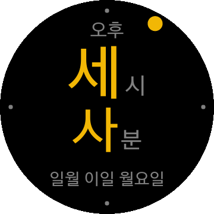

# HangulWatch

겔럭시 워치 용 워치페이스, 한글손목시계.

# Download and Import
Clone project to directory, `hangulwatch`:

    $ cd tizen-workspace
    $ git clone https://github.com/suapapa/tizen_wearable_hangulwatch hangulwatch

Run Tizen Studio then `File` -> `Open Projects From File System...` then choose above directory.

# Run on emulator
`Run` -> `Run As` -> `1 Tizen Web Application`

# Run on real device
TBD

# License
FREE
